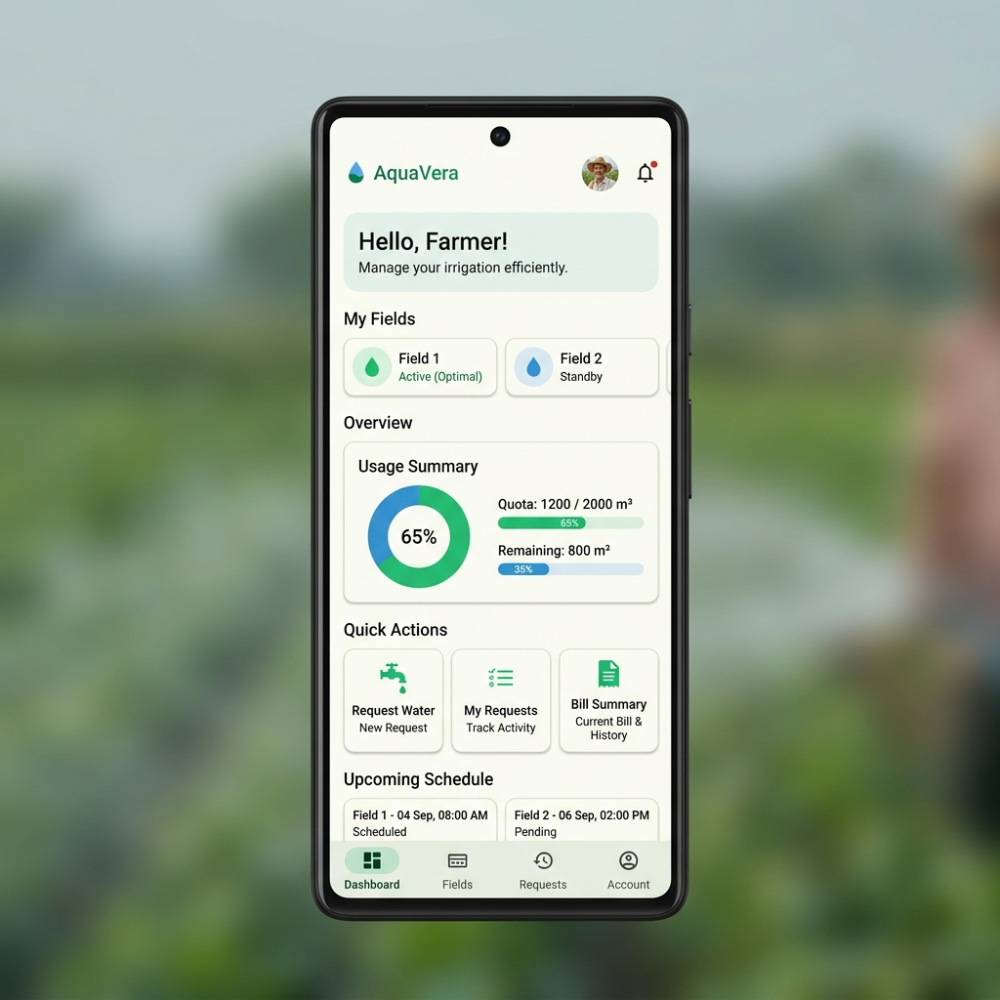

<p align="center">
  
</p>

<h1 align="center">AquaVera</h1>

<p align="center">
  <strong>Empowering Farmers with Sustainable Water Management</strong>
</p>

<p align="center">
  <a href="#features">Features</a> •
  <a href="#tech-stack">Tech Stack</a> •
  <a href="#getting-started">Getting Started</a> •
  <a href="#architecture">Architecture</a> •
  <a href="#team">Team</a> •
  <a href="#contributing">Contributing</a>
</p>

<p align="center">
  
  
  
  
</p>

---

## 🌊 Overview

**AquaVera** is a professional Android application designed to revolutionize water distribution and management for the agricultural sector. By bridging the gap between water resources and farmers, AquaVera ensures equitable, transparent, and efficient water allocation for diverse crop types.

Whether you're managing cereals, pulses, or high-value cash crops, AquaVera provides a streamlined interface to request water, track billing, and manage your farm's irrigation needs directly from your smartphone.

## ✨ Features

- 🌍 **Multi-Language Support**: Fully localized to support various regional languages, making it accessible to a diverse farming community.
- 🔐 **Secure Authentication**: Robust login and sign-up flow with OTP verification and password recovery.
- 🚜 **Smart Water Requests**: Precision requests based on crop type (Cereals, Pulses, Oilseeds, etc.) and irrigation duration.
- 📸 **Visual Verification**: Integrated camera functionality to capture farm images for request validation.
- 📊 **Dynamic Dashboard**: Real-time overview of current requests, pending bills, and land summaries.
- 💳 **Integrated Billing & Payments**: Seamless bill generation and secure payment gateway integration.
- 🔔 **Instant Notifications**: Stay updated with real-time alerts on request status and billing.
- 📋 **Profile & Land Management**: Easy-to-use profile setup to manage personal and land-specific information.

## 📸 Visuals

<p align="center">
  
  <br/>
  <em>Modern, user-centric Dashboard designed for ease of use in the field.</em>
</p>

## 🛠 Tech Stack

- **UI Framework**: [Jetpack Compose](https://developer.android.com/jetpack/compose) for a modern, declarative UI.
- **Programming Language**: [Kotlin](https://kotlinlang.org/) for concise and safe code.
- **Backend-as-a-Service**: [Supabase](https://supabase.com/) (Database & Authentication).
- **Architecture**: **MVVM** (Model-View-ViewModel) for clean separation of concerns.
- **Navigation**: [Compose Navigation](https://developer.android.com/jetpack/compose/navigation) for seamless screen transitions.
- **Dependency Injection**: Integrated Jetpack components.
- **Image Handling**: Custom camera integration for farm verification.

## 🚀 Getting Started

### Prerequisites

- Android Studio Hedgehog (2023.1.1) or higher.
- Kotlin 1.9.0+.
- Android SDK Level 34 (Upside Down Cake).

### Setup Instructions

1. **Clone the Repository**:
   ```bash
   git clone https://github.com/chetanngavali/AquaVera-App.git
   ```

2. **Open in Android Studio**:
   File > Open > Select the `AquaVera2` directory.

3. **Supabase Configuration**:
   - Create a project on [Supabase](https://supabase.com/).
   - Set up your Database tables and Auth providers.
   - Add your Supabase URL and Anon Key in the `SupbaseClient.kt` or localized configuration.

4. **Build & Run**:
   Sync Gradle and run the app on an emulator or physical device.

## 🏗 Architecture

AquaVera follows the **MVVM** architecture pattern:

- **View**: Jetpack Compose screens that observe state from ViewModels.
- **ViewModel**: Manages UI business logic and interacts with the Repository/Service layer.
- **Model**: Data entities and Supabase DTOs.
- **Service/Utils**: Centralized logic for Supabase, Billing, and Email operations.

## 👥 Meet the Team

<p align="center">
  <b>Project Leads & Developers</b>
</p>

<table align="center">
  <tr>
    <td align="center">
      <br />
      <sub><b>Chetan Gavali</b></sub><br />
      Android Developer
    </td>
    <td align="center">
      <br />
      <sub><b>Kalyani</b></sub><br />
      Team Leader & Researcher
    </td>
    <td align="center">
      <br />
      <sub><b>Harshita</b></sub><br />
      Tester & Researcher
    </td>
    <td align="center">
      <br />
      <sub><b>Varad</b></sub><br />
      Full Stack Development
    </td>
  </tr>
</table>

## 🤝 Contributing

Contributions are welcome! Please see [CONTRIBUTING.md](CONTRIBUTING.md) for guidelines on how to get started.

## 📜 License

This project is licensed under the **MIT License**. See the [LICENSE](LICENSE) file for details.

## 📧 Contact

**Chetan Gavali** - [GitHub](https://github.com/chetanngavali)

---
<p align="center">
  Made with ❤️ for the farming community.
</p>
